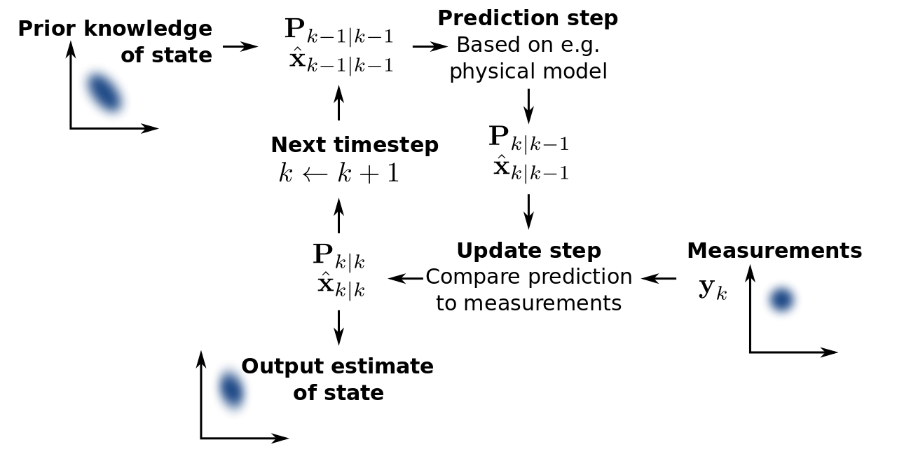

# Overview

## What does the Kalman filter do?


**Kalman filtering**, also known as **linear quadratic estimation** (LQE), is an algorithm that uses a series of measurements observed over time, containing statistical noise and other inaccuracies, and produces estimates of unknown variables that tend to be more accurate than those based on a single measurement alone, by using Bayesian inference and estimating a joint probability distribution over the variables for each timeframe. The filter is named after Rudolf E. Kálmán, one of the primary developers of its theory.

[Source: WIKIPEDIA](https://en.wikipedia.org/wiki/Kalman_filter)

## See it in action

<iframe style="height:450px;" src="https://www.youtube.com/embed/0GSIKwfkFCA" frameborder="0" allowfullscreen></iframe>

## Basic concept



## Kalman process chart

```{r, echo=FALSE}
library('DiagrammeR')

grViz("Kalman_Chart.gv")
```

## 3 step process

1. Calculate Kalman gain
2. Update estimate
3. Update error in estimate

## 1. Kalman gain

$\text{kalman gain} = KG = \frac{E_{EST}}{E_{EST} + E_{MEA}}$

```{r, eval=FALSE, echo=TRUE}
kalman.gain = current.estimate.error / ( current.estimate.error + current.measurement.error )
```

## 2. Update estimate

* $\text{measurement} = MEA$
* $\text{current estimate} = EST_t$ 
* $\text{previous estimate} = EST_{t-1}$

$$EST_t = EST_{t-1} + KG [MEA - EST_{t-1} ]$$

```{r, eval=FALSE, echo=TRUE}
current.estimate = previous.estimate + kalman.gain * (measurement - previous.estimate)
```

## 3. Update error in estimate

$$E_{EST_t} = \frac{E_{MEA}E_{EST_{t-1}}}{E_{MEA}+E_{EST_{t-1}}} \Rightarrow [1-KG] E_{EST_{t-1}}$$

```{r, eval=FALSE}
current.estimate.error = ( current.measurement.error * previous.error ) / 
                         ( current.measurement.error + previous.error )
```

```{r, eval=FALSE}
current.estimate.error = (1 - kalman.gain) * previous.error
```

## {.smaller}

```{r}
KalmanFilter <- function(current.estimate, current.estimate.error, current.measurment, current.measurement.error) {
  # Apply Kalman filter. Calculates new estimate
  # and error of estimation
  #
  # Args:
  #   current.estimate          : Current estimation of the variable of interest
  #   current.estimate.error    : Current error in the estimation
  #   current.measurment        : Measured value
  #   current.measurement.error : Constant error of measurement instrument
  #
  # Returns:
  #   updated.estimate       : Updated estimate of variable of interest
  #   updated.estimate.error : Updated error of the estimate
  
  # Calculate Kalman gain
  kalman.gain = current.estimate.error / ( current.estimate.error + current.measurement.error )
  
  # Update estimate
  updated.estimate = current.estimate + kalman.gain * (current.measurment - current.estimate)
  
  # Update error in estimate
  updated.estimate.error = (1 - kalman.gain) * current.estimate.error
  
  # Create return list
  return( list(updated.estimate       = updated.estimate,
               updated.estimate.error = updated.estimate.error)
        )
}
```

# Example

## Temperature

Use Kalman filter to estimate the true temperatur of 72 degrees F with error of 4.

* Measurement
* Original estimate
* Original error in estimate

```{r}
current.measurment        <- 75
current.measurement.error <- 4
current.estimate          <- 68
current.estimate.error    <- 2
```

## Apply Kalman filter once

```{r, eval=TRUE}
KalmanFilter(current.estimate, current.estimate.error, current.measurment, current.measurement.error) 
```

## Apply Kalman filter {.smaller}

```{r}
temperatures <- c(75, 71, 70, 74)
n            <- length(temperatures)

# Store results
results <- matrix(NA, n, 3)

for (i in 1:n) {
  
  # Set current measurement
  current.measurment <- temperatures[i]
  
  # Store result
  results[i,] <- c(current.measurment, current.estimate, current.estimate.error)
  
  kalman.filter.results <- KalmanFilter(current.estimate, current.estimate.error, current.measurment, current.measurement.error)

  current.estimate          <- kalman.filter.results$updated.estimate
  current.estimate.error    <- kalman.filter.results$updated.estimate.error

}
```

## Results

```{r}
results
```

# Comparisons

## Compare Kalman gain to:

Method           | Equation                                                   |
-----------------|------------------------------------------------------------|
Kalman gain      | $EST_t = EST_{t-1} + KG [MEA - EST_{t-1} ]$                |
Gradient descent | $b_t = b_{t-1} + LR (Y - \hat{Y})$                         |
Elo rating       | $\text{Rating}_t = \text{Rating}_{t-1} + K (S - \hat{S} )$ |

## Used resource

<iframe style="height:450px;" src="https://www.youtube.com/embed/videoseries?list=PLX2gX-ftPVXU3oUFNATxGXY90AULiqnWT" frameborder="0" allowfullscreen></iframe>

# END

  <a href="https://twitter.com/shklinkenberg" target="_blank" style="color:inherit; border-bottom:none; ">@shklinkenberg</a>